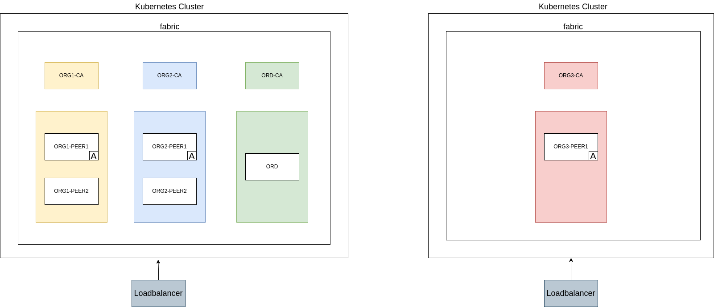

# HLF Opertor - Adding new Org from different cluster


### Installing the Operator and Istio - Cluster 2

```bash
cd ~/hlf-operator
helm install hlf-operator ./chart/hlf-operator
istioctl install --set profile=default -y
```

### Create CA - Cluster 2

```bash
export SC=$(kubectl get sc -o=jsonpath='{.items[0].metadata.name}')
export DOMAIN=...
kubectl-hlf ca create --storage-class="$SC" --capacity=2Gi --name=org3-ca --enroll-id=enroll --enroll-pw=enrollpw  --namespace=fabric --hosts=org3-ca.${DOMAIN} --istio-ingressgateway=ingressgateway --istio-port=443
kubectl-hlf ca register --name=org3-ca --user=org3-peer1 --secret=peerpw --type=peer --enroll-id enroll --enroll-secret=enrollpw --mspid=Org3MSP --namespace=fabric
```

### Create peer - Cluster 2

```bash
kubectl-hlf peer create --storage-class="$SC" --enroll-id=org3-peer1 --mspid=Org3MSP --enroll-pw=peerpw --capacity=5Gi --name=org3-peer1 --ca-name=org3-ca.fabric --namespace=fabric --statedb=couchdb --hosts=org3-peer1.${DOMAIN} --istio-ingressgateway=ingressgateway  --istio-port=443
kubectl-hlf ca register --name=org3-ca --user=admin --secret=adminpw --type=admin --enroll-id enroll --enroll-secret=enrollpw --mspid=Org3MSP --namespace=fabric
kubectl-hlf ca enroll --name=org3-ca --user=admin --secret=adminpw --ca-name ca  --output org3-peer.yaml --mspid=Org3MSP --namespace=fabric
```

### Connection Profile

```bash
kubectl hlf inspect --output org3.yaml  -o Org3MSP
kubectl hlf utils adduser --userPath=org3-peer.yaml --config=org3.yaml --username=admin --mspid=Org3MSP
```

### Get Crypto Material - Cluster 2

```bash
kubectl hlf org inspect -o Org3MSP --output-path=crypto-config
```

### Modifing channel - Cluster 1

```bash
kubectl hlf channel addorg --peer=org1-peer1.fabric --name=mychannel --config=networkConfig.yaml --user=admin --msp-id=Org3MSP --org-config=configtx.yaml --dry-run > org3.json
configtxlator proto_encode --input org3.json --type common.ConfigUpdate --output org3.pb
```

```bash
echo '{"payload":{"header":{"channel_header":{"channel_id":"mychannel", "type":2}},"data":{"config_update":'$(cat org3.json)'}}}' | jq . > config_update_in_envelope.json
```

```bash
configtxlator proto_encode --input config_update_in_envelope.json --type common.Envelope --output config_update_in_envelope.pb
```

```bash
kubectl hlf channel signupdate --channel=mychannel -f config_update_in_envelope.pb --user=admin --config=networkConfig.yaml --mspid=Org1MSP --output org1-mychannel-update-sign.pb
kubectl hlf channel signupdate --channel=mychannel -f config_update_in_envelope.pb --user=admin --config=networkConfig.yaml --mspid=Org2MSP --output org2-mychannel-update-sign.pb
```

### Updating channel - Cluster 1

```bash
kubectl hlf channel update --channel mychannel -f config_update_in_envelope.pb --config=networkConfig.yaml --user=admin --mspid=Org1MSP -s org1-mychannel-update-sign.pb -s org2-mychannel-update-sign.pb
```

### adjust the network config add the orderer detail
Add the orderer section in the `org3.yaml`

### join the channel - Cluster 2

```bash
kubectl hlf channel join --name=mychannel --config=org3.yaml --user=admin -p=org3-peer1.fabric
```

### Adding the anchor peer - Cluster 2

```bash
kubectl-hlf channel addanchorpeer --channel=mychannel --config=networkConfig.yaml --user=admin --peer=org3-peer1.fabric
```

### Install CC - Cluster 2

```bash
kubectl-hlf chaincode install --path=./chaincode/fabcar/go --config=org3.yaml --language=golang --label=fabcar --user=admin --peer=org3-peer1.fabric
```

### Approve CC - Cluster 2

```bash
PACKAGE_ID=
kubectl hlf chaincode approveformyorg --config=org3.yaml --user=admin --peer=org3-peer1.fabric \
    --package-id=$PACKAGE_ID \
    --version "1.0" --sequence 2 --name=fabcar --policy="OR('Org1MSP.member', 'Org2MSP.member','Org3MSP.member')" --channel=mychannel
```

### Invoke/Query CC - Cluster 2

```bash
kubectl-hlf chaincode invoke --config=org3.yaml --user=admin --peer=org3-peer1.fabric --chaincode=fabcar --channel=mychannel --fcn=CreateCar -a "1000" -a "honda" -a "civic" -a "blue" "aditya"
kubectl hlf chaincode query --config=org3.yaml --user=admin --peer=org3-peer1.fabric --chaincode=fabcar --channel=mychannel --fcn=QueryAllCars
```
